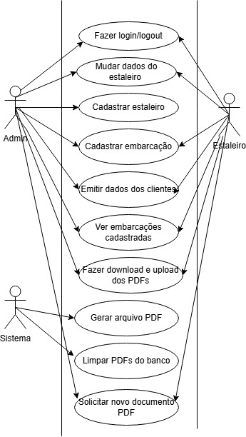
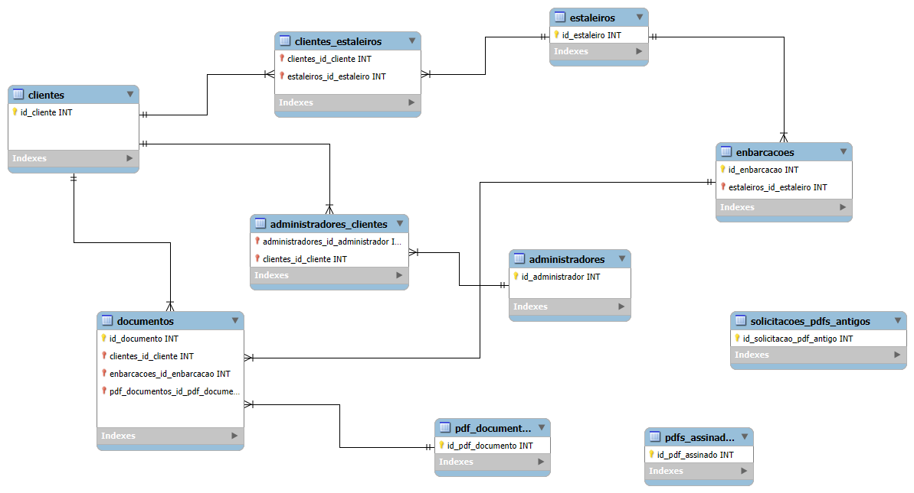

# Gestor de documentos náuticos - DPSN
## Plataforma de gerenciamento de documentos náuticos da empresa DPSN
### CENTRO PAULA SOUZA  
### FACULDADE DE TECNOLOGIA DE JAHU  
### CURSO DE TECNOLOGIA EM DESENVOLVIMENTO DE SOFTWARE MULTIPLATAFORMA 
### Jau, SP, BR
### Inicio: 2° Semestre / 2025
---
# Documento da aplicação web
### Autores
- Anelize Nardelli
- João Pedro Pascuci De Russi
- Luis Eduardo Abdo dos Santos
# Sumário
  - [1. Descrição da aplicação web](#1-descrição-da-aplicação-web)
    - [1.1 Introdução](#11-introdução)
    - [1.2 Métodos da pesquisa](#12-método-de-pesquisa)
  - [2. Documento de requisitos](#2-documento-de-requisitos)
    - [2.1. Requisitos funcionais](#21-requisitos-funcionais)
    - [2.2. Requisitos não funcionais](#22-requisitos-não-funcionais)
  - [3. Regras de negócios](#3-regras-de-negócio)
      - [3.1 Figura 1- Modelo de nogócio canvas](#31-figura-1--modelo-de-nogócio-canvas)
      - [3.2 Proposta de valor](#32-proposta-de-valor)
      - [3.3 Parcerias-chaves](#33-parcerias-chaves)
      - [3.4 Recursos-chave](#34-recursos-chave)
      - [3.5 Atividades-chave](#35-atividades-chave)
      - [3.6 Relacionamento com cliente](#36-relacionamento-com-cliente)
      - [3.7 Canais de distribuição](#37-canais-de-distribuição)
      - [3.8 Segmento de clientes](#38-segmento-de-clientes)
      - [3.9 Estrutura de custos](#39-estrutura-de-custos)
      - [3.10 Fonte de receita](#310-fonte-de-receita)
  - [4. Modelo de casos de uso](#4-modelo-de-casos-de-uso)
      - [4.1 Figura 2- Modelo de casos de uso](#41-figura-2--modelo-de-casos-de-uso)  
      - [4.2 Casos de uso de alto nível](#42-casos-de-uso-de-alto-nível)  
      - [4.3 Casos de uso expandidos](#43-casos-de-uso-expandidos)
  - [5. Diagrama de Classes](#5-diagrama-de-classes) 
  - [6. Diagrama Entidade-Relacionamento](#6-diagrama-entidade-relacionamento) 
    - [6 1. Figura 3- Diagrama Entidade-Relacionamento](#61-figura-3-diagrama-entidade-relacionamento) 
  
  
        

## 1. Descrição da aplicação web
## 1.1 Introdução
Esse projeto é uma plataforma web desenvolvida com o objetivo de automatizar o preenchimento de documentos náuticos emitidos por estaleiros parceiros da empresa DPSN. A aplicação visa simplificar e agilizar o processo de emissão e gerenciamento de documentos navais, processo que atualmente na maioria dos casos é feito manualmente. 

A solução proposta é um sistema digital que centraliza e automatiza esse fluxo de trabalho. A plataforma permitirá que o estaleiro insira as informações do cliente e da embarcação de forma padronizada. Com base nesses dados, o sistema irá automaticamente gerar o documento necessário, de acordo com o modelo da embarcação, e convertê-lo para o formato PDF. 

O arquivo PDF gerado ficará disponível para que o tecnólogo naval da empresa possa acessá-lo, aplicar sua assinatura digital de forma segura, e reencaminhá-lo ao estaleiro através da própria plataforma. Isso não apenas elimina a necessidade de múltiplas trocas de e-mail e manipulação manual de arquivos, mas também cria um registro digital de cada documento, facilitando o gerenciamento e a auditoria de todas as embarcações. 

Este sistema, portanto, oferece uma solução robusta para otimizar o processo de documentação náutica, reduzindo o tempo de resposta, minimizando erros e garantindo a conformidade e a segurança dos dados.  
## 1.2 Método de pesquisa 
Ao desenvolver a aplicação web, serão utilizadas diversas ferramentas e tecnologias apresentadas no curso de Desenvolvimento de Software Multiplataforma (DSM), integrando conceitos abordados ao longo das aulas. Algumas dessas ferramentas incluem tecnologias de desenvolvimento front-end e back-end, além de metodologias de engenharia de software. 

As tecnologias usadas no Front-end do projeto incluem HTML, CSS, JavaScript e o framework Bootstrap. O Beck-end do nosso projeto vai usar a linguagem PHP, ferreamentas como o XAMPP está sendo utilizada e o nosso bando de dados feito no MySQL. O protótipo do projeto foi criado no Figma.

## 2. Documento de requisitos
## 2.1 Requisitos Funcionais
### **RF 1 - Cadastrar Administrador**
Possibilitar que um administrador/tecnólogo crie uma conta e gerencie suas aplicações. 
### **RF 2 - Cadastrar Estaleiros**
Possibilitar que o administrador crie uma conta dos estaleiros com que trabalha. Colocando informações como nome, endereço, CEP, CNPJ, email, senha e telefone.  
### **RF 3 - Cadastrar Embarcações**
Permitir que o administrador cadastre as embarcações de cada estaleiro com que trabalha.  
### **RF 4 - Gerencia de dados dos estaleiros**
Possibilitar que o estaleiro troque sua senha e modifique seus dados se necessário.
### **RF 5 - Realizar login e logout**
Todos os administradores e estaleiros podem realizar login e logout do sistema.
### **RF 6 - Emitir dados dos clientes**
Os estaleiros e administradores podem emitir os dados de um cliente para gerar um documento. Dados como nome, endereço, informações sobre a embarcação comprada e data da emissão.
### **RF 7 - Ver sobre as embarcações**
Os estaleiros e administradores podem ver quais embarcações foram cadastradas e ver as informações da cada uma delas.
### **RF 8 - Gerar documento PDF**
O sistema deve gerar um arquivo PDF para cada documento náutico que for criado, e deixar a mostra para o tecnólogo e o estaleiro assiná-lo.
### **RF 9 - Fazer download e upload dos PDFs**
Os usuários podem fazem download dos PDFs para assinar os documentos, após a assinatura eles podem fazer o upload do documento assinado.
### **RF 10 - Limpar os PDFs do banco de dados**
Os PDFs dos documentos serão excluidos automaticamente de 30 em 30 dias, os dados vão estar salvos, apenas o PDF vai ser excluido.
### **RF 11 - Solicitar um documento PDF**
Os estaleiros e administradores podem solicitar documentos antigos, que o PDF não está mais disponível para download, para gerar um novo PDF.

## 2.2 Requisitos Não Funcionais
### **RNF 1 - Usabilidade**
 A aplicação deve ser fácil de entender e usar, com uma interface limpa e formulários diretos, com explicações claras dos indicadores, para que diferentes tipos de usuários possam navegar sem problemas. 
### **RNF 2 - Acessibilidade**
O sistema deve ser acessível para todos os tipos de usuários, incluindo aqueles com necessidades especiais.
### **RNF 3 - Proteção de dados**
Os dados de cada usuário deve ser protegido. Cada usuário acessa os seus respectivos dados.
### **RNF 4 Criptografia de dados sensíveis**
O sistema deve criptografar os dados sensíveis de todos os usuários.

## 3. Regras de negócio
## 3.1 Figura 1- Modelo de nogócio canvas

    

# 3.2 Proposta de valor 
Criar uma aplicação web para facilitar e automatizar o trabalho da empresa DPSN. E criar uma forma de armazenar seus documentos digitalmente, melhorando a organização e o gerenciamento deles.
## 3.3 Parcerias-chaves
- Empresa DPSN
- Faculdade de Tecnologia de Jahu (Fatec Jahu)
## 3.4 Recursos-chave
- Ferramentas de desenvolvimento
- Documentação
- Organização da equipe
## 3.5 Atividades-chave
- Preencher automaticamente os documentos náuticos
- Desenvolvimento e manutenção da aplicação
## 3.6 Relacionamento com cliente
- Feedback da empresa 
- Contato com a empresa
## 3.7 Canais de distribuição
- O uso da aplicação pela empresa
- Uso da aplicação pelos estaleiros parceiros da empresa
## 3.8 Segmento de clientes
- Tecnólogos 
- Estaleiros parceiros da DPSN
- Clientes dos estaleiros 
- Empresas do ramo naval
## 3.9 Estrutura de custos
- Manutenção da aplicação
- Hospedagem 
- Suporte
## 3.10 Fonte de receita
- investimentos da própria empresa DPSN
## 4. Modelo de casos de uso
## 4.1 Figura 2- Modelo de casos de uso

    

## 4.2 Casos de uso de alto nível
### 1- Cadastrar Administrador
- Atores: Administrador (Autocadastro).
- Tipo: Secundário.
- Descrição: Permite que um futuro Administrador/Tecnólogo crie uma conta no sistema para começar a gerenciar estaleiros e documentos.
### 2- Cadastrar estaleiro
- Atores: Administrador.
- Tipo: Primário.
- Descrição: O Administrador insere as informações necessárias (nome, CNPJ, contato, etc.) para criar o registro de um Estaleiro parceiro no sistema.
### 3- Cadastrar embarcação
- Atores: Administrador.
- Tipo: Primário.
- Descrição: O Administrador registra os modelos de embarcações de um Estaleiro específico no sistema, associando-as ao respectivo parceiro.
###  4- Gerenciar dados do estaleiro
- Atores: Estaleiro.
- Tipo: Secundário.
- Descrição: Permite que o Estaleiro autenticado no sistema acesse e modifique suas informações cadastrais (exceto identificadores únicos) e altere sua senha.
### 5- Realizar login 
- Atores: Administrador, Estaleiro.
- Tipo: Secundário.
- Descrição: O usuário (Administrador ou Estaleiro) insere suas credenciais de acesso para entrar no sistema.
### 6- Realizar logout
- Atores: Administrador, Estaleiro.
- Tipo: Secundário.
- Descrição: O usuário (Administrador ou Estaleiro) encerra sua sessão de forma segura no sistema.
### 7- Vizualizar embarcações cadastradas 
- Atores: Estaleiro, Administrador.
- Tipo: Secundário.
- Descrição: O usuário acessa uma lista das embarcações cadastradas no sistema e pode visualizar os detalhes de cada modelo.
### 8- Apagar documentos PDFs antigos 
- Atores: Sistema (Automatizado).
- Tipo: Secundário.
- Descrição: O sistema executa uma rotina automática a cada 30 dias para excluir os arquivos PDF armazenados, mantendo os dados do documento no banco de dados.

## 4.3 Casos de uso expandidos
### 1- Emitir Dados do Cliente e da Embarcação
- Atores: Estaleiro (iniciador), Administrador.
- Finalidade: Coletar as informações necessárias do cliente e da transação de venda da embarcação para iniciar a geração do documento náutico.
- Visão Geral: O Estaleiro (ou Administrador, agindo em nome de um Estaleiro) acessa a funcionalidade de emissão e insere os dados obrigatórios do cliente (nome, endereço, etc.) e da embarcação vendida, incluindo o modelo e a data da transação. Estes dados são validados e salvos para acionar a geração do documento.
- Tipo: Primário e Essencial.
- Referências Cruzadas: RF 6.
### 2- Gerar Documento PDF
- Atores: Sistema (iniciador automático após a emissão dos dados).
- Finalidade: Criar o arquivo de documento náutico padronizado (Termo de Responsabilidade, Declaração, etc.) no formato PDF com base nos dados fornecidos e deixá-lo disponível para assinatura e download.
- Visão Geral: Após a submissão bem-sucedida dos dados do cliente e da embarcação (Caso de Uso "Emitir Dados..."), o Sistema processa essas informações. Ele seleciona o modelo de documento correto para a embarcação, preenche o template automaticamente e converte o resultado final para um arquivo PDF seguro. O sistema armazena o PDF e notifica o Administrador/Tecnólogo sobre o novo documento pendente.
- Tipo: Primário e Essencial.
- Referências Cruzadas: RF 8.
### 3- Fazer Upload do Documento PDF Assinado
- Atores: Administrador (Tecnólogo, iniciador).
- Finalidade: Permitir que o Tecnólogo Naval anexe a versão final e legalmente assinada do documento náutico ao registro do sistema, concluindo o ciclo de documentação.
- Visão Geral: O Administrador (Tecnólogo), após ter baixado o PDF gerado, aplicado sua assinatura digital de forma segura e validado o documento, retorna à plataforma. Ele seleciona o documento correspondente e faz o upload do novo arquivo PDF assinado, substituindo ou marcando o original. O sistema registra o upload e o documento passa ao status de "Assinado".
- Tipo: Primário e Essencial.
- Referências Cruzadas: RF 9.
### 4- Solicitar Novo Documento PDF
- Atores: Estaleiro (iniciador), Administrador.
- Finalidade: Regenerar o arquivo PDF de um documento antigo, cujos dados persistem no banco de dados, mas o arquivo PDF foi automaticamente excluído pela rotina de limpeza.
- Visão Geral: O usuário (Estaleiro ou Administrador) localiza um registro de documento náutico antigo no sistema. Ao verificar que o PDF não está mais disponível, ele aciona a função de "Solicitar Novo PDF". O Sistema acessa os dados salvos do documento e executa novamente o processo de geração de PDF (similar ao Caso de Uso 2), disponibilizando o novo arquivo para download.
- Tipo: Primário e Essencial.
- Referências Cruzadas: RF 11.

## 5. Diagrama de classes
### As tabelas abaixo mostra o nosso diagrama de classes
### 1- classe administrador
| Nome | administradores |
| :---- | :---- |
| Atributos | id\_administrador BIGINT UNSIGNED AUTO\_INCREMENT PRIMARY KEY,  email VARCHAR(100) UNIQUE NOT NULL senha VARCHAR(255) NOT NULL, nome VARCHAR(100) NOT NULL, data DATETIME NOT NULL esta\_ativo BOOLEAN DEFAULT TRUE |
| Métodos | fazerLogin(email, senha), atualizarDados(dados) |

### 2- classe estaleiro
| Nome | estaleiros |
| :---- | :---- |
| Atributos | id\_estaleiro BIGINT UNSIGNED AUTO\_INCREMENT PRIMARY KEY,  nome VARCHAR(100) NOT NULL, nome\_empresa VARCHAR(100) NOT NULL, cnpj VARCHAR(18) UNIQUE NOT NULL, endereco VARCHAR(255) NOT NULL, cep VARCHAR(10) NOT NULL ,telefone VARCHAR(50) NOY NULL ,email VARCHAR(100) UNIQUE NOT NULL, senha VARCHAR(255) NOT NULL, data DATETIME NOT NULL |
| Métodos | crudEmbarcacoes(dadosEmbarcacao), crudClientes(dadosCliente), crudVendas(dadosVenda), solicitarNovoPDF(id\_documento), visualizarMeusDocumentos() |

### 3- classe embarcações
| Nome | embarcacoes |
| :---- | :---- |
| Atributos | id\_embarcaao BIGINT UNSIGNED AUTO\_INCREMENT PRIMARY KEY,  estaleiro\_id BIGINT USINGNED NOT NULL FOREIGN KEY (estaleiro\_id) REFERENCES estaleiros(id\_estaleiro), nome VARCHAR(255) NULL, comprimento\_total DECIMAL(8,2), NOT NULL boca\_moldada  DECIMAL(8,2) NOT NULL, pontal\_moldado DECIMAL(8,2) NOT NULL, calado\_maximo DECIMAL(8,2) NOT NULL, calado\_leve DECIMAL(8,2) NOT NULL, arqueacao\_bruta DECIMAL(8,2) NOT NULL, arqueacao\_liquida DECIMAL(8,2) NOT NULL, tpb DECIMAL(8,2) NOT NULL, contorno DECIMAL(8,2) NOT NULL, lastro DECIMAL(8,2) NULL, area\_navegacao\_tipo\_servico VARCHAR(255) NOT NULL, tipo\_embarcacao VARCHAR(255) NOT NULL, material\_casco VARCHAR(255) NOT NULL, motorizacao\_max INT NOT NULL, motorizacao\_min INT NOT NULL, data DATETIME NOT NULL  |
| Métodos | crudEmbarcacoes(dadosEmbarcacao), atualizarDados(dados) |

### 4- classe clientes
| Nome | clientes |
| :---- | :---- |
| Atributos | id\_cliente BIGINT UNSIGNED AUTO\_INCREMENT PRIMARY KEY,  nome VARCHAR(100) NOT NULL, cpf\_cnpj VARCHAR(18) UNIQUE NOT NULL, endereco VARCHAR(255) NOT NULL, ano\_construcao YEAR NOT NULL, chassi\_emb VARCHAR(255) NOT NULL, data DATETIME NOT NULL |
| Métodos |  |

### 5- classe clientes_estaleiros
| Nome | clientes\_estaleiros |
| :---- | :---- |
| Atributos | id\_cliente\_estaleiro BIGINT UNSIGNED AUTO\_INCREMENT PRIMARY KEY,  estaleiro\_id FOREIGN KEY  (estaleiro\_id ) references estaleiros(id\_estaleiro), cliente\_id FOREIGN KEY (id\_cliente) references clientes(id\_cliente), data DATETIME NOT NULL |
| Métodos |  |

### 6- classe clientes_administradores
| Nome | clientes\_administradores |
| :---- | :---- |
| Atributos | id\_cliente\_administrador BIGINT UNSIGNED AUTO\_INCREMENT PRIMARY KEY,  cliente\_id FOREIGN KEY  (cliente\_id ) references clientes(id\_cliente), administrador\_id  FOREIGN KEY (administrador\_id) references administradores(id\_administrador),  data DATETIME NOT NULL |
| Métodos |  |

### 7- classe documentos
| Nome | documentos |
| :---- | :---- |
| Atributos | id\_documento BIGINT UNSIGNED AUTO\_INCREMENT PRIMARY KEY,  estaleiro\_id INT FOREIGN KEY (estaleiro\_id ) references estaleiros(id\_estaleiro) NULL, administrador\_id  FOREIGN KEY (administrador\_id) references administradores(id\_administrador) NULL, embarcacao\_id INT FOREIGN KEY (embarcacao\_id ) references embarcacoes(id\_embarcacao), cliente\_id INT FOREIGN KEY (cliente\_id ) references clientes(id\_cliente), data\_emissao DATETIME NOT NULL, status\_documento; ENUM('Assinatura Pendente', 'Assinado', 'Expirado') DEFAULT Assinatura Pendente', caminho\_pdf VARCHAR(255) NULL, data\_expiracao\_pdf DATETIME NULL |
| Métodos | gerarPDF() baixarPDF() expirarPDF() |

## 6. Diagrama Entidade-Relacionamento
## 6.1 Figura 3-Diagrama Entidade-Relacionamento 

    

